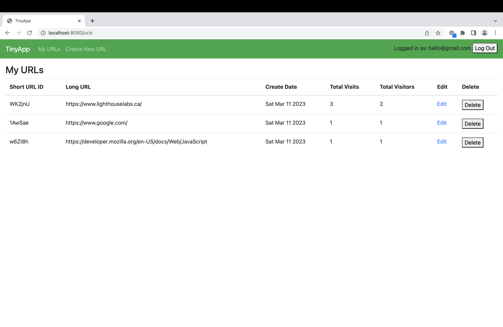

# TinyApp Project

TinyApp is a full stack web application built with Node and Express that allows users to shorten long URLs (à la bit.ly).

## Features

- Create short URLs with authentication protection
- Keep track of the visits to each short URL
- Update an existing short URL

## Final Product

## Dependencies

- Node.js
- Express
- EJS
- bcryptjs
- cookie-session
- cookie-parser
- method-override

## Getting Started

- Install all dependencies (using the `npm install` command).
- Run the development web server using the `npm start` command.